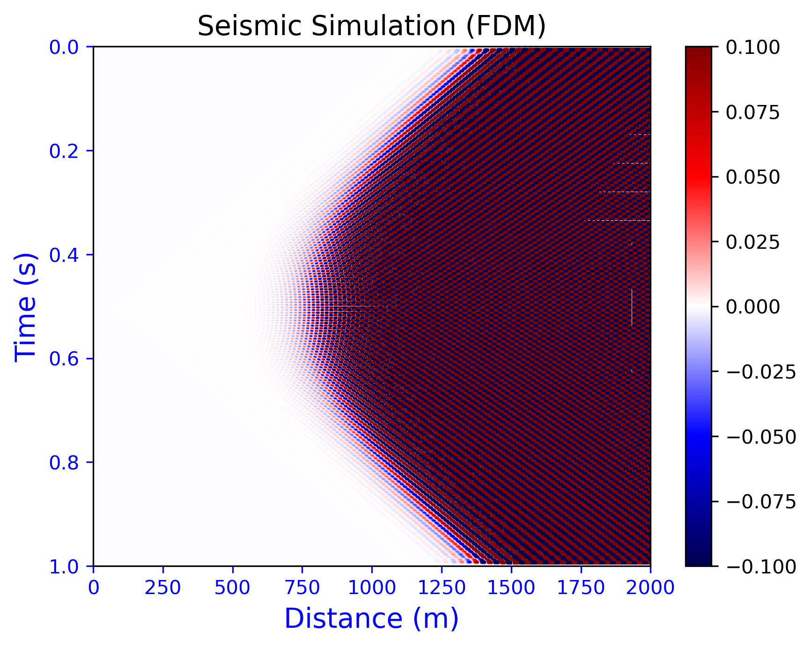

# Seismic Simulation (FDM)

This is a Python implementation of seismic wave propagation using the Finite Difference Method (FDM). The program simulates the propagation of a seismic wave in a 1D medium, and the result is a 2D plot of the wavefield at different times.

## Prerequisites

- Python 3.x
- NumPy
- Matplotlib

## Usage
The simulation can be run by executing the `SeismicSimulationFDM.py` file. You can adjust the simulation parameters by changing the values of the variables in the `if __name__ == '__main__':` block.

The available parameters are:

- nx: number of grid points in x-direction
- nt: number of time steps
- dx: grid spacing (m)
- dt: time step (s)
- vp: P-wave velocity (m/s)
- f0: dominant frequency of the source wavelet (Hz)
- src_x: source location (m)
- rec_x: receiver location (m)

After running the simulation, a 2D plot of the wavefield will be displayed.

## Class Methods

### `__init__(self, nx, nt, dx, dt, vp, f0, src_x, rec_x)`

Initialize the seismic simulation.

### `ricker_wavelet(self, t)`

Generate a Ricker wavelet at time `t`.

### `simulate(self)`

Simulate the seismic wave propagation.

### `visualize(self, u)`

Visualize the simulation result.

## References

- Virieux, J., & Operto, S. (2009). An overview of full-waveform inversion in exploration geophysics. Geophysics, 74(6), WCC1-WCC26.

## contact
email: oren.sternberg.icloud.com

GitHub: [@0r3ntal](https://github.com/0r3ntal/SeismicSimulationFDM)
